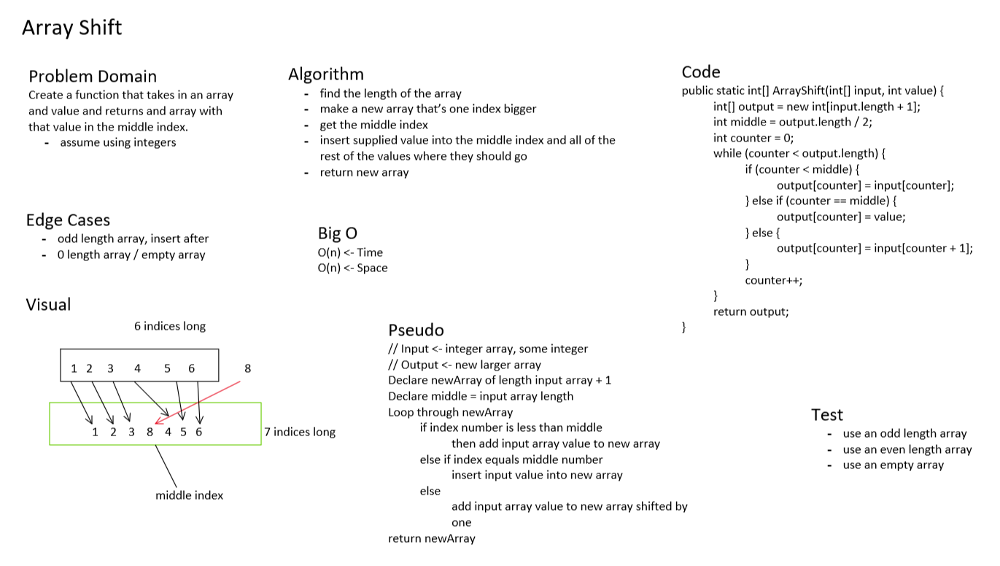

### Code Challegne 02
# Peyton Cysewski & Mike Wohl

 - [x] Top-level README “Table of Contents” is updated

 - [x] Feature tasks for this challenge are completed

 - [x] Unit tests written and passing
     - [x] “Happy Path” - Expected outcome
     - [x] Expected failure
     - [ ] Edge Case (if applicable/obvious)

 - [x] README for this challenge is complete
     - [x] Summary, Description, Approach & Efficiency, Solution
     - [x] Link to code
     - [x] Picture of whiteboard

     
# Challenge Summary
Write a function to take in an array and value that returns a new array with the supplied value at middle index.

## Challenge Description
Take in array and int value.
Create new array that contains supplied int.
Locate middle index.
Move int to middle index.
Return array.

## Approach & Efficiency
Peyton helped me understand whiteboarding and its constituent parts as this was quite new to me. We walked through pseudocode, algorithm, and Big O to set up the code we wrote.

## Solution
