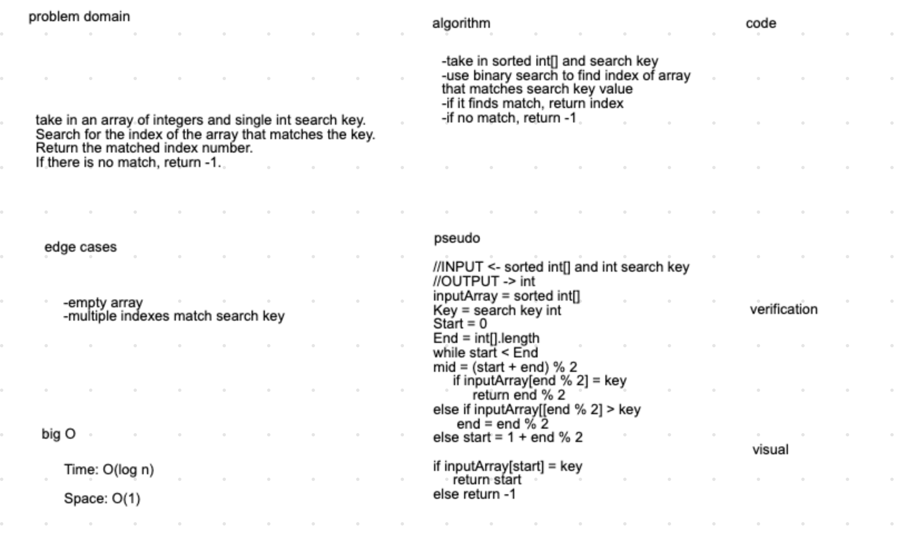

### Code Challegne 03
# Jack Nelson & Mike Wohl

 - [x] Top-level README “Table of Contents” is updated

 - [x] Feature tasks for this challenge are completed

 - [x] Unit tests written and passing
     - [x] “Happy Path” - Expected outcome
     - [x] Expected failure
     - [ ] Edge Case (if applicable/obvious)

 - [x] README for this challenge is complete
     - [x] Summary, Description, Approach & Efficiency, Solution
     - [x] Link to code
     - [x] Picture of whiteboard

     
# Challenge Summary
Take in a sorted array and search int value. If array contains value, return index number. If not, return -1.

## Challenge Description
take in an array of integers and single int search key.
Search for the index of the array that matches the key.
Return the matched index number.
If there is no match, return -1.
Provide meaningful tests to verify program works.

## Approach & Efficiency
We spent a good amount of time whiteboarding the problem domain and the pseudocode which helped us when it came time to write the actual code and tests.

## Solution
